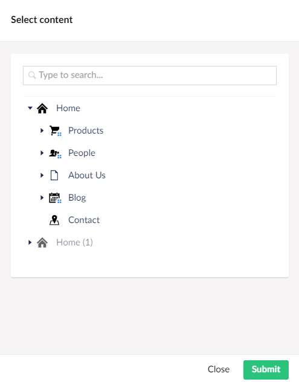

Bulk Translations allow you to easily build bundles of content from the same translation set and send them for translation. You can pick your translation set from anywhere within a site. 

The Bulk Translations tab can be found in the content section of Umbraco.

## Selecting Content

Click on the select content button, and it will open a menu that shows all of you content. From here you can click on individual pages and select what you want to be a part of your bundle.

Once you have selected your desired content, you can click submit. 

## Send To Translate

When your chosen content is subitted, it will display on the Bulk Translations tab, allowing you to view everything selected. 

If you are satisfied with this content, you can click Send to translate. 

This will open another side menu, displaying your content, the languages you can translate it to, and an option to create a job. 

Once you are happy with your settings, you can click the Create button to translate your content. 