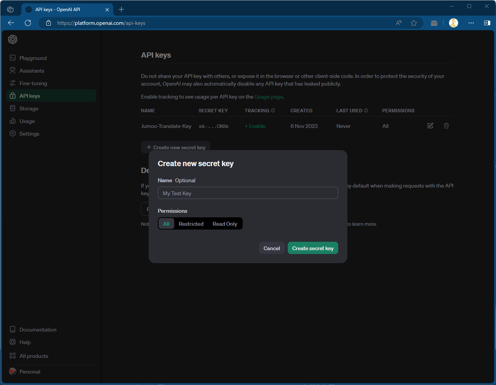
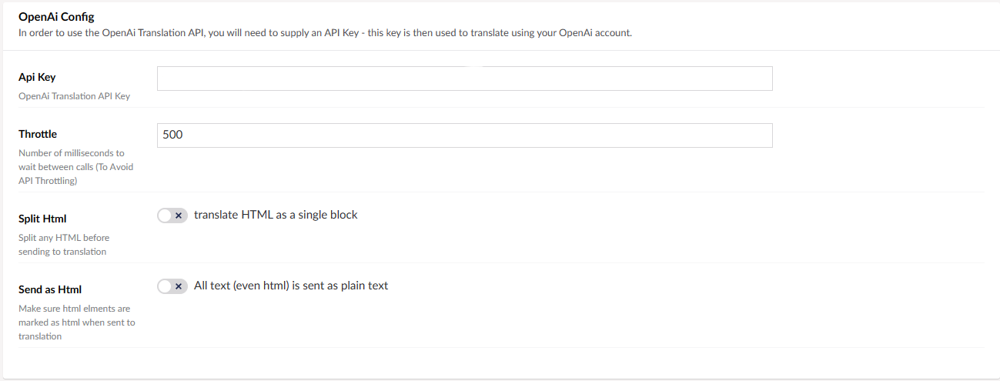
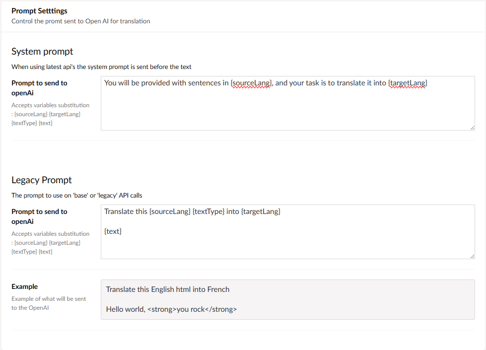

The OpenAI connector allows you to translate via the OpenAI api, using a number of different Large Language Model (LLM) AI's.

:::tip
Translation via OpenAI can be complex and require tuing - the connector has a lot of specific settings that tune the API.

For more information on how the AI requests can be tuned you should refere to the [OpenAI documentation](https://platform.openai.com/docs/introduction).
:::

# Installing

```
dotnet add package Jumoo.TranslationManager.OpenAi
```

## Generate an OpenAi Api Key

You will need to generate an API key on the OpenAi website.

- Login to OpenAi
- Naivigate to the API section
- Create a new API key



- Make sure you copy the generated key!

## Add Key to Connector settings

- Paste the API key into the OpenAI connector page within Translation Manager settings



## Connector Options.

The OpenAI connector options allow you to tweak how the connector talks to the OpenAI Api.


For more information on these settings consult the [OpenAI Documentation](https://platform.openai.com/docs/introduction).

## Prompt

All text is sent to the OpenAI in the form of a prompt, you can tweak how the prompt looks by chaning the prompt settings in the connector.



For System based prompts (used by most language models). The prompt will be sent followed by a number of lines of text that will be translated by the model.

The connector will then take the values from the response and use them to form the basis for the translation that is returned to the system.
