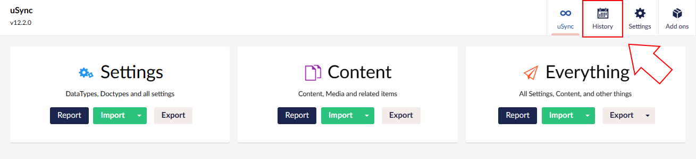
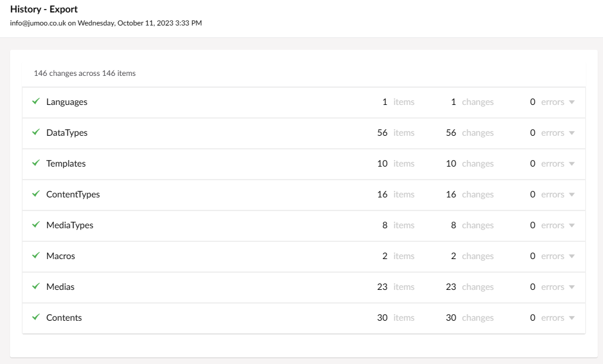

The History feature logs imports and exports, allowing you to keep track of every change added to your files.

### Navigating to the History Page

To find the History page, navigate to Settings, and then uSync. The History tab is in the top right corner of the uSync settings page.

### What does it do?

History will show you what changes were made in recent imports/exports. It will also tell you how much was changed, who changed it, and when. 

The page will not display an import or export if there were no differences between versions.

You can use the clear button to clear the record of imports and exports.

### The More Detailed View

You can click on an import or export to see all the changes made in more detail.

This allows you to track individual differences in the individual files that were synced.

### Detailed Imported Changes

 On an import you can track changes even more specifically.

 

 If you click on an import, and then click Details on a changed file, you can see *exactly* what was changed.

