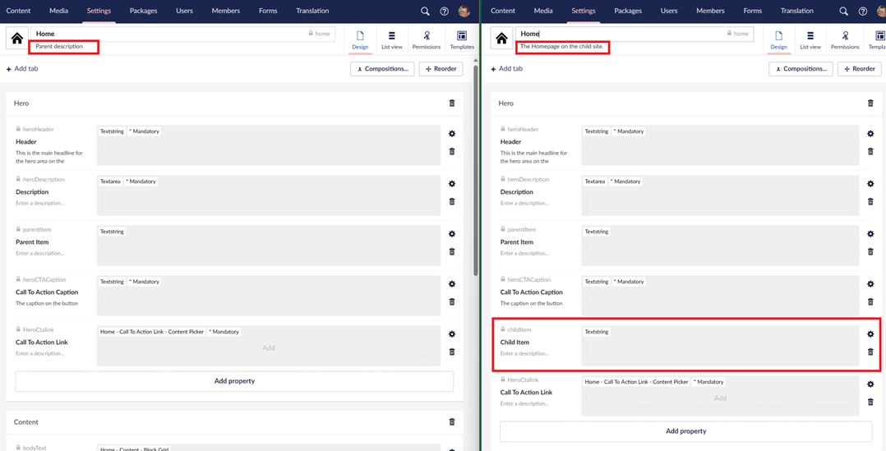
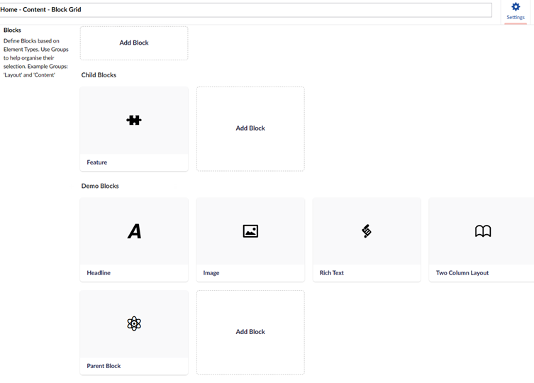

uSync Roots lets you have a root (or many roots) site that you can then base other sites on, and with those other sites you can either overwrite or sync them back to your root site as and when you need to.

Root sites put their files in `/uSync/roots` and ‘child’ sites put their files in `/uSync/v9`.

## Importing with uSync Roots

When importing, uSync will automatically merge `the uSync/roots` and `uSync/v9` trees into one seamless uSync import. This means you get both the changes from the root site and the changes from the child site all in one.

## Saving/Exporting with uSync Roots

When you save on your child site, depending on your settings uSync will either: save a copy of your changes the `uSync/v9` folder **or** it will stop you from making the change.

Files in the `uSync/v9` folder take precedence, so a change on the child site will overwrite a change on the root site.

## Getting Started

### 1. Create a "Root" site.

Your root site is defined with a setting in `appSettings.json`.

```cs
{
    "uSync": {
        "Settings": {
            "IsRootSite" : true
        }
    }
}
```

Cleaning out the uSync folder and performing an export will get you your uSync/root folder.

### 2. Link a “Child” Site

Your child site just needs the `uSync/root` folder copying into it, and its good to go!

By default, the child site will be locked from overwriting root items, and won’t let you
save the changes in the UI. You can disable this by setting LockRoot to false in the config of the child site.

```cs
{
    "uSync": {
        "Settings": {
            "LockRoot": false 
        }
    }
}
```

When you want to update a child site copy the root folder to its uSync folder and import.

# Fancy Merging

What if you want to add a new property to a content type on a child site and you still want to get any updates from the root site? With fancy merging, you can do that.

Fancy merging means when you add a new property to a content type on a child site, uSync will store just that property change and not overwrite the settings from the root content type.

Then, when it comes time to import, uSync merges the two sets of properties for the content type together, and making a combination of what you have on the child site and what you have on the root.

This works for deleting as well! You can delete a property that was set on the root, and still get all the other root properties and updates through to your site.



## Fancy DataType Config Merging

Fancy merging for DataTypes allows us to blend together configuration from both the root and the child sites. This way you get a mix of the things you setup on your root, and extra you might want to add for a child site.

This might not be useful for a lot of DataTypes, but for things like BlockLists and BlockGrids it can be.

## BlockList/BlockGrid Merging

You can have a core set of blocks defined in a BlockList on on your root site, and then you can add to that list on your child site.

If you add new blocks to the root, when you import them to the child site they are added straight in and you get to keep your additional child blocks. 



By default, uSync roots will fancy merge, BlockLists, BlockGrids, and imageCroppers.

:::tip
 uSync roots default config makes it work for one root, but it can have many. You can define a set of folders in the Folders setting and uSync will merge them all (first -> last, so the last folder takes precedence).
:::