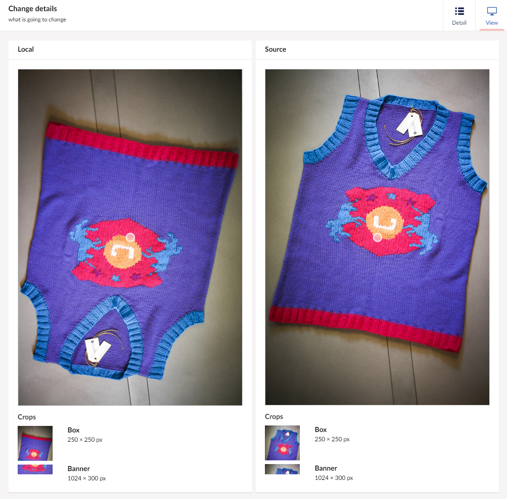

Remote Media, like [Remote Content](RemCont), allows you to individually check differences before you sync anything. However, Remote Media focuses on your media specifically. 

## Navigating Remote Media

The Remote Media tab can easily be found in the Umbraco backoffice. Navigate to the Media root, and there it is. From there you can click on a local, or remote server to see where the differences are.

uSync will markt he media with differences as Different, making it easy to see what will stay the same and what will change when you sync.

 

For even more control, you can click on the Different label, and see the two versions side by side.

Once you are sure you don't mind the differences, you can push your changes from here.