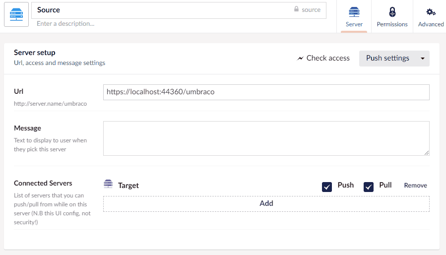

Once you have set up the server, you can check if access is correctly configured by clicking the 'Check Access' button

The Check Access button will give you the following responses: 

Response | Possible Cause
---------|---------------
Available | Everything is working.
Unauthorized | The AppID/AppKey used is incorrect.
Unreachable | The server cannot be contacted (it could be turned off).
Disabled | The target server is not enabled (check its settings).
ServerError | There is something wrong with the target server.
