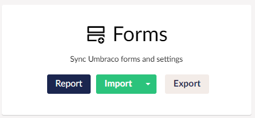

To install and use uSync.Forms you will first need to install [Umbraco Forms](https://umbraco.com/products/add-ons/forms/). 

## Installation

To Install uSync.Forms, type the following commands into the Visual Studio Package Manager Console, command line, or add the reference directly into the .csproj file.

import Tabs from '@theme/Tabs';
import TabItem from '@theme/TabItem';

<Tabs
  defaultValue="core"
  values={[
    { label: 'Package Manager', value: 'pm', },
    { label: 'Dotnet', value: 'core', },
    { label: 'Package reference', value: 'ref' }
  ]
}>
<TabItem value="pm">

```cli
install-package uSync.Forms 
```

</TabItem>
<TabItem value="core">

```cli
dotnet add package uSync.Forms
```

</TabItem>
<TabItem value="ref">

```cli
<PackageReference Include="uSync.Forms" Version="VERSION" />
```

</TabItem>
</Tabs>

## Using uSync.Forms

Once uSync.Forms is installed, You should see the Forms entry on the uSync dashboard.




### With uSync.Complete

If you have uSync.Complete you can right click on a form to push or pull it.


